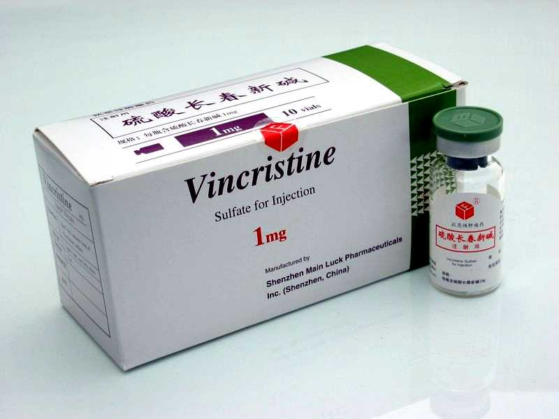
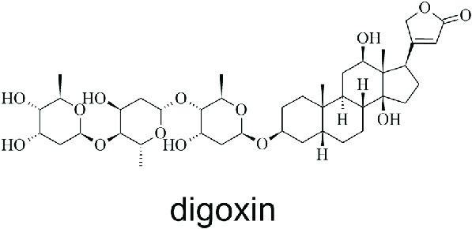

---
authors:
- Carmen
categories: []
date: "2019-06-05T00:03:00Z"
draft: false
featured: false
image:
  caption: ""
  focal_point: ""
projects: []
subtitle: 
summary: 
tags: [Shikonine, medicine, secondary, pesticide, toxicity]
title: Examples of the uses of secondary metabolites
---

### Although plants may survive without the use of secondary metabolites these compound extracts have great advantages:    

### For example  

```{r, fig.cap="**Shikonine** is a red pigment that is manufactured by *Lithospermum eryrorhizon* cells which has been used for cosmetics such as lipsticks. ", echo=FALSE}
knitr::include_graphics("./lipstick.jpg")
```  

```{r, fig.cap="**Vincristine sulphate** is manufactured from *Vinca rosea* and is helpful for treating cancer. ", echo=FALSE}

```  

Other compounds which are used to treat cardiovascular disorders include **Digoxin**.  

```{r, fig.cap="Structure of Digoxin.", echo=FALSE}

```  

```{r, fig.cap="Some secondary metabolites have the ability to protect plants against harmful UV rays (Bourgaud et al., 2001). Here, secondary metabolites are produced by redirecting the primary metabolism in plants leading to protection of leaves from UV rays.", echo=FALSE}
knitr::include_graphics("./sun.gif")
```  

```{r, fig.cap="Some compounds may release toxins that deter herbivorous insects and animals, for example, **Pyrithrin** is a compound used as an insecticide.", echo=FALSE}
knitr::include_graphics("./insect.jpg")
``` 

```{r, fig.cap="The Madagascar Periwinkel, also mentioned by MacQueen (1988) has useful secondary metabolites (**ajmalicine**) which help lower blood pressure. ", echo=FALSE}
knitr::include_graphics("./peri.jpg")
``` 

__________________________________________________________________________

 
