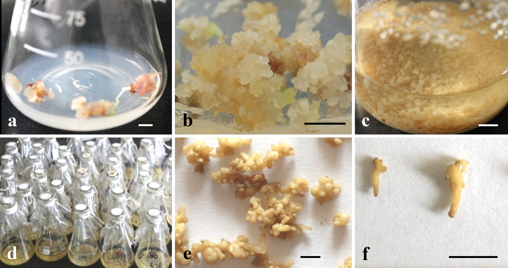

---
authors:
- Carmen
categories: []
date: "2019-06-05T00:05:00Z"
draft: false
featured: false
image:
  caption: ""
  focal_point: ""
projects: []
subtitle: 
summary: 
tags: [biotechnology, primary, secondary, metabolites, traditional medicine, genetic modificaiton, survival]
title: An overview - Plants, biotechnology and metabolites 
---

Plants have been used as a source of traditional medicine for decades (Fennell et al., 2004). Most plants, especially medicinal plants have antibacterial, anti-inflammatory, antioxidant, antifungal, antischistosomal, anthelminthic, antimalarial and anti-amoebic properties (Fennell et al., 2004). However, purification and extraction processes differ between compounds with technological improvements being needed for more complex compounds. Plant compound extraction is mostly for commercial purposes, for example *in vitro* methods may be used to produce large quantities to meet product demands (Bourgaud et al., 2001). Extracting material from plants has become easier with modern technology, however, there have been very few successful productions of valuable secondary metabolites (Bourgaud et al., 2001).  

Biotechnology is known to be one of the greatest benefits to humankind and is constantly being improved (Boulter, 1995). Some of the earliest types of biotechnology included agriculture and making beer and bread (Boulter, 1995). Since then, technology has improved greatly; humans have managed to introduce desirable traits into organisms through genetic modification and engineering, especially in plants (Boulter, 1995; Bourgaud et al., 2001). These processes form part of plant biotechnology.  

Cellular metabolism carries out important biochemical reactions with the assistance of metabolites (Hussain et al., 2012). The metabolites that are found in plants are categorized into two categories, namely primary and secondary metabolites (MacQueen, 1988; Hussain et al., 2012). The first category is important for a plant’s growth and development; whilst the second category plays a more vital role in the later stages of a plant's life by contributing to the plant's overall survival (Hussain et al., 2012). Secondary metabolite absence may not have short-term gains, however, it may affect the long-term survival of the plant (Hussain et al., 2012).  

```{r, fig.cap="An example of plant biotechnology. A cell suspension culture showing friable callus (a mass of undifferentiated cells) from the hypocotyl of a plant.", echo=FALSE}

```  

```{r, fig.cap="Linkages between primary and secondary metabolites. [Click here to see more.](https://www.intechopen.com/books/secondary-metabolites-sources-and-applications/an-introductory-chapter-secondary-metabolites)", echo=FALSE}
knitr::include_graphics("./pathways.png")
```  

__________________________________________________________________________
