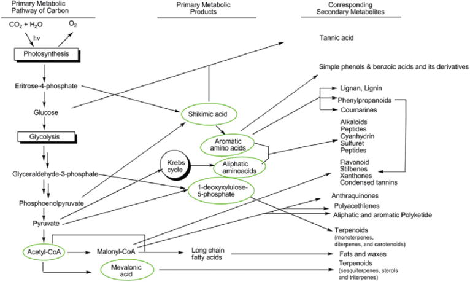

---
authors:
- Carmen
categories: []
date: "2019-06-05T00:02:01Z"
draft: false
featured: false
image:
  caption: ""
  focal_point: ""
projects: []
subtitle: 
summary: 
tags: []
title: A closer look at secondary metabolites
---

Whilst primary metabolites include only a small range of compounds (proteins, carbohydrates, and lipids), secondary metabolites entail a wide range of compounds (alkaloids, steroids, flavonoids, tannins, phenolics etcetera) (Class notes, Prof Finnie, 2019). Most secondary metabolite compounds are produced by plants as a defence mechanism, protecting themselves against toxins and pathogens in their surroundings (Bourgaud et al., 2001). Some compounds in this group are have the ability to protect plants against harmful UV rays whilst others release toxins that deter herbivorous insects and animals (Bourgaud et al., 2001).  

For centuries, these compounds have played an important role in traditional medicines, their discovery is often due to their high toxicity levels, which increase the visibility of effectiveness (may show effects in only a few hours) (Bourgaud et al., 2001) (Class notes, Prof Finnie, 2019). Secondary metabolites are considered economically important for the use of drugs, flavours, fragrances, insecticides, and dyes (Pagare et al., 2015).  For example, a diterpene alkaloid, Taxol (paclitaxel), is found in the bark of Taxus trees and is known for its anticancer effects (Hussain et al., 2012).    

These compounds are very specific as they usually only occur in specific localities in plants and are not widely distributed among taxa or species (Hussain et al., 2012). They usually accumulate in small quantities and are therefore difficult to extract and purify, which is among the main reasons for their high economic value (Bourgaud et al., 2001). 


```{r, fig.cap="An example of plant biotechnology: A cell suspension culture showing friable callus (a mass of undifferentiated cells) from the hypocotyl of a plant.", echo=FALSE}
knitr::include_graphics("./callus.jpeg")
``` 

```{r, fig.cap="Indicating the link between primary and secondary metabolites.  [Click here to see more.](https://www.intechopen.com/books/secondary-metabolites-sources-and-applications/an-introductory-chapter-secondary-metabolites)", echo=FALSE}

```

__________________________________________________________________________

[Install Anaconda](https://www.anaconda.com/distribution/#download-section) which includes Python 3 and Jupyter notebook.

Otherwise, for advanced users, install Jupyter notebook with `pip3 install jupyter`.

## Create a new blog post [as usual](https://sourcethemes.com/academic/docs/managing-content/#create-a-blog-post)

Run the following commands in your Terminal, substituting `<MY_WEBSITE_FOLDER>` and `my-post` with the file path to your Academic website folder and a name for your blog post (without spaces), respectively:  

```bash
cd <MY_WEBSITE_FOLDER>
hugo new  --kind post post/my-post
cd <MY_WEBSITE_FOLDER>/content/post/my-post/
```

## Create or upload a Jupyter notebook

Run the following command to start Jupyter within your new blog post folder. Then create a new Jupyter notebook (*New > Python Notebook*) or upload a notebook.

```bash
jupyter notebook
```

## Convert notebook to Markdown

```bash
jupyter nbconvert Untitled.ipynb --to markdown --NbConvertApp.output_files_dir=.

# Copy the contents of Untitled.md and append it to index.md:
cat Untitled.md | tee -a index.md

# Remove the temporary file:
rm Untitled.md
```

## Edit your post metadata

Open `index.md` in your text editor and edit the title etc. in the [front matter](https://sourcethemes.com/academic/docs/front-matter/) according to your preference.

To set a [featured image](https://sourcethemes.com/academic/docs/managing-content/#featured-image), place an image named `featured` into your post's folder.

For other tips, such as using math, see the guide on [writing content with Academic](https://sourcethemes.com/academic/docs/writing-markdown-latex/). 
